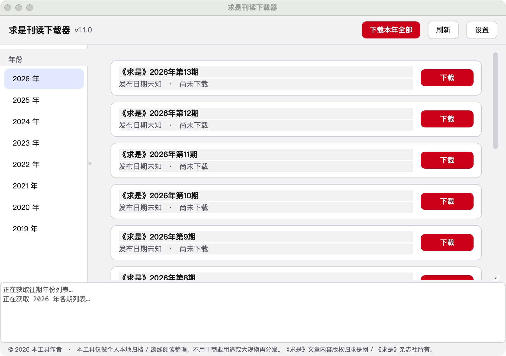

# 求是刊读下载器 (Qiushi Downloader)

自动抓取求是网 (www.qstheory.cn) 已发布的《求是》期刊内容，按期生成排版精美的 PDF，
并以**该期实际发布日期和时间**命名保存，例如：

```
2026-07-01_09-00-00_求是_2026年第13期.pdf
```

跨平台桌面应用（macOS / Windows / Linux），基于 Python + PySide6（Qt6），
界面随系统浅色/深色主题自动切换，macOS 下遵循原生控件观感。

---

## 安装

需要 Python 3.10+。

```bash
cd qiushi_downloader
python -m venv .venv
source .venv/bin/activate        # Windows: .venv\Scripts\activate
pip install -r requirements.txt
```

## 运行

```bash
python main.py
```

## 运行截图


首次运行会在"文稿/Documents/QiuShi_PDF"下创建保存目录（可在设置里更改）。

## 打包为独立 App（可选）

macOS（生成 .app）：

```bash
pip install pyinstaller
pyinstaller --windowed --name "求是刊读下载器" \
  --icon assets/icon.icns \
  main.py
```

Windows（生成 .exe）同理，把 `--icon` 换成 `.ico` 文件即可；PyInstaller 对
PySide6 + QtWebEngine 的支持是现成的，无需额外配置。

---

## 功能

- 按年份浏览、按期下载，或"下载本年全部"
- 每期一个进度条：抓取文章 → 排版渲染 → 完成，状态实时可见
- 文件名 = 该期**真实发布日期时间** + 期号，已存在的文件自动跳过、不重复下载
- 界面浅色/深色跟随系统（macOS/Windows/Linux 均可），也可在设置里手动指定
- 设置项：PDF 保存位置、抓取请求间隔（避免请求过快）、内容来源、自动检查开关与频率
- 后台线程做全部网络请求，UI 全程不卡顿；PDF 渲染通过线程安全的"桥接"对象
  安全地跑在 GUI 线程（QtWebEngine 的硬性要求）

## 目录结构

```
qiushi_downloader/
├── main.py            # 入口
├── config.py           # 持久化设置（QSettings，跨平台原生存储位置）
├── models.py            # Issue / Article 数据结构
├── scraper.py            # 抓取逻辑 + 插件基类/注册表（含 --selftest）
├── pdf_builder.py         # HTML 排版 + QtWebEngine 渲染为 PDF
├── downloader.py           # 后台线程调度、文件命名、状态机
├── ui/
│   ├── theme.py             # 跟随系统的浅/深色主题
│   └── main_window.py        # 主界面
└── requirements.txt
```

## 合规提醒

《求是》是公开发布的官方期刊网页内容，本工具仅做**个人本地归档/离线阅读**用途的自动化整理，
请遵守 qstheory.cn 网站声明及 robots 规则，抓取时保持默认的请求间隔（设置中可调），
不要用于大规模再分发。
